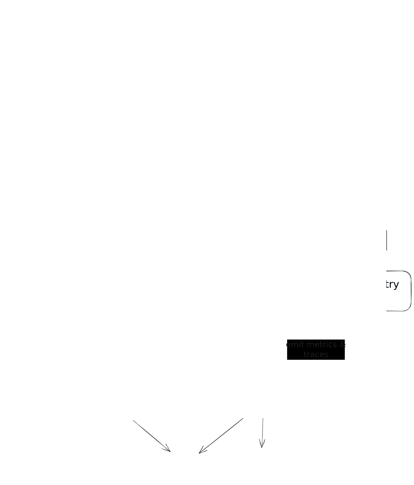
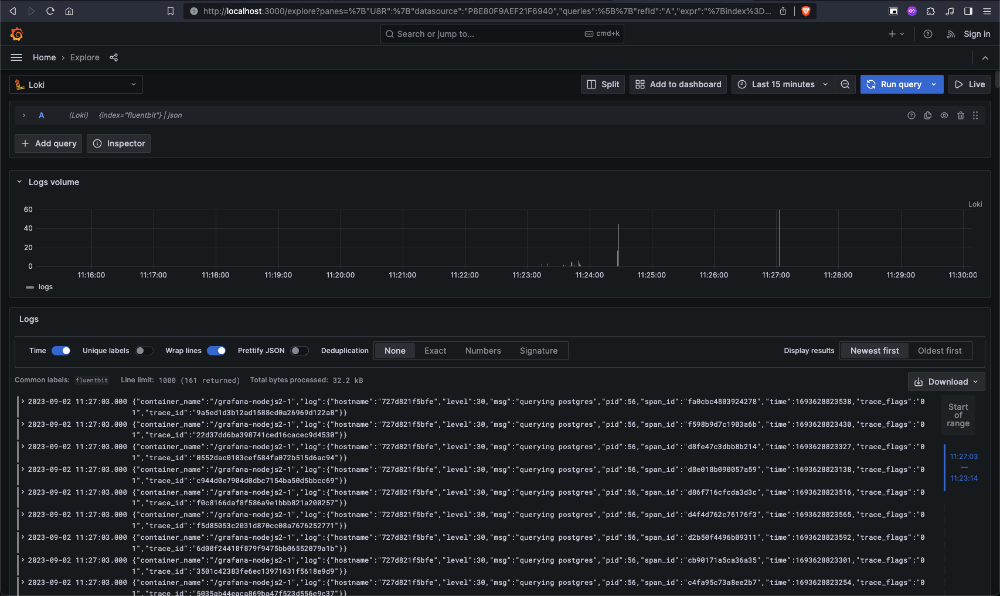
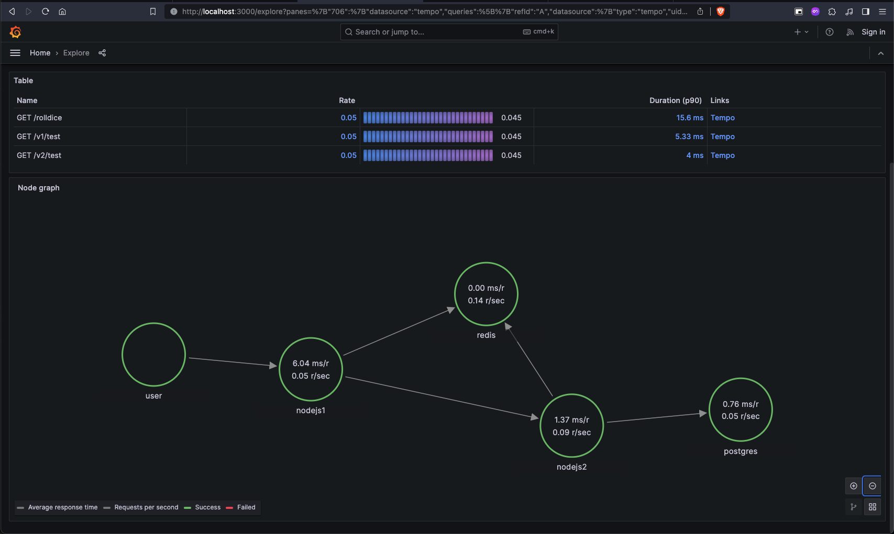
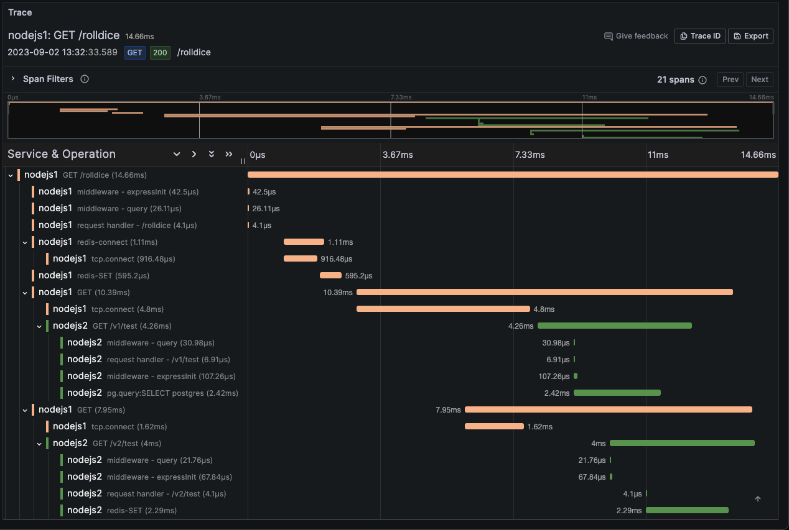

# Open logging tracing

A PoC (proof of concept) of a logging and tracing system using modern open source observability tech stack:

- [Grafana](https://grafana.com/)
- [Grafana Loki](https://grafana.com/oss/loki/)
- [Grafana Tempo](https://grafana.com/oss/tempo/)
- [Prometheus](https://prometheus.io/)
- [OpenTelemetry](https://opentelemetry.io/)
- [FluentBit](https://fluentbit.io/)

Microservice runtime and tech stack:

- Docker
- Node.js with Express
- [OpenTelemetry Node.js SDK](https://opentelemetry.io/docs/instrumentation/js/)
- Postgres, Redis

## High-level architecture

Diagram created using <https://excalidraw.com/>

## Start system locally

- Docker pre-installed on machine (only tested with **x86_64** arch in latest commit)
- Simply run `make up`
- Wait for few seconds for services to start

## API requests

- Run `make run` to make API call to microservice

## View logs and traces

- Go to Grafana at <http://localhost:3000>
- Go to **Explore**
- View **logs with Loki** data source

- View **traces and service graph with Tempo**

